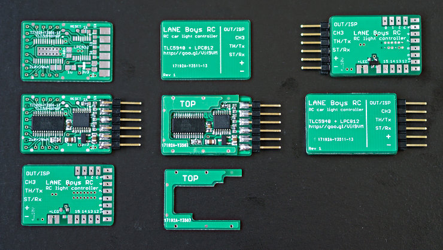

# Light controller for Radio Controlled cars

Realistic lighting of RC model cars using a standard 3-channel radio control system.

The light controller supports the following features, and more::

- **16 LED outputs, constant-current** driven. Up to 20mA per output. Two light
controllers can be cascaded for a total of 32 LED outputs.
(Mk4 and Mk4P only)

- 1 high current non-dimmable **switched output** of up to **2A** to drive a roof light bar
(Mk4S: 9 non-dimmable switched outputs)

- **Parking, Low-beam, High-beam** and a roof **light bar** can be switched on/off manually from the transmitter

- **Brake** and **Reversing** lights are **automatically** controlled by monitoring the throttle channel. The brake lights now automatically turn on for a short, random time when the throttle goes to neutral.

- **Combined tail and brake light** function in a single LED through controlling the brightness of the LED. (Mk4 and Mk4P only)

- **Indicators** only come on when you want to. You have to stay in neutral for one seconds, then hold the steering left/right for one second before they engage. This way normal driving does not trigger the indicators.

- **Hazard lights** can be switched on/off from the transmitter

- **Programmable output** designed to drive a **steering wheel** or a figures head, or a
**gearbox servo**

- Automatic center and end-point adjustment for steering and throttle channels

- **16 LEDs** can be driven by one light controller. Two controllers can be **daisy-chained for up to 32 LEDs**.

- **Light Programs for custom light animations** like police lights, running lights ...

- Simulation of incandescent lights and faulty ground wiring

- Optional **i-Bus** compatible input

- Optional Pre-Processor for **easier wiring**

- **Up to 3 AUX channels** can control light functions when using the **5-channel Pre-
Processor**

- All functions can be **customized through a [web browser](https://laneboysrc.github.io/rc-light-controller/)**

## Documentation

An **introduction video** can be found at:

- [https://youtu.be/-VyNAVU3-ok](https://youtu.be/-VyNAVU3-ok)

You may also want to read the **[users guide](doc/light-controller-instructions-mk4.pdf)** to get a grasp of the full functionality of this light controller system.

(Die [Bedieungsanleitung ist auch in Deutsch](doc/light-controller-instructions-mk4-deutsch.pdf) verfügbar)

## Hardware

Firmware and schematics for the different variants are included in this project.

Over the years, the light controller went through various iterations. The document [doc/hardware-overview.md](doc/hardware-overview.md) explains the history of development.

[The current MK4 variant](mk4-tlc5940-lpc812/) can drive **16 LEDs** with a **constant current**. It utilises an inexpensive **NXP ARM Cortex-M0 32-bit microcontroller**.
The main advantage of this design is that it can be fully configured through a [web-based user interface](https://laneboysrc.github.io/rc-light-controller/). Firmware and configuration can be downloaded with a standard USB-to-serial converter, no proprietary tools required.

## Unable to build one yourself?

Not everyone is able to build circuit boards with tiny SMD components. If this applies to you please contact [laneboysrc@gmail.com](mailto:laneboysrc@gmail.com), we usually have a few fully built-up units in stock.

## Related articles

- [http://laneboysrc.blogspot.com/2012/07/diy-car-light-controller-for-3-channel.html](http://laneboysrc.blogspot.com/2012/07/diy-car-light-controller-for-3-channel.html)

- [http://laneboysrc.blogspot.com/2013/09/diy-rc-light-controller-update.html](http://laneboysrc.blogspot.com/2013/09/diy-rc-light-controller-update.html)

- [http://laneboysrc.blogspot.com/2012/12/pre-processor-for-diy-rc-light.html](http://laneboysrc.blogspot.com/2012/12/pre-processor-for-diy-rc-light.html)

- [http://laneboysrc.blogspot.com/2013/01/pre-processor-miniaturization.html](http://laneboysrc.blogspot.com/2013/01/pre-processor-miniaturization.html)

- [http://laneboysrc.blogspot.com/2014/07/ws2812-and-pl9823-led-power-consumption.html](http://laneboysrc.blogspot.com/2014/07/ws2812-and-pl9823-led-power-consumption.html)

- [http://laneboysrc.blogspot.com/2014/08/diy-rc-light-controller-with-ws2812b.html](http://laneboysrc.blogspot.com/2014/08/diy-rc-light-controller-with-ws2812b.html)
