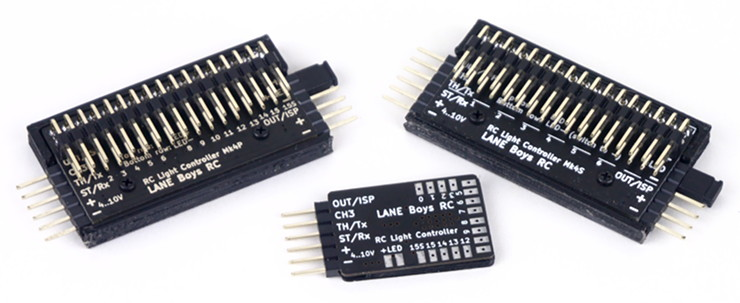

# Hardware overview

Over time the DIY RC Light Controller hardware went through several iterations.

The following sections describe the various variants in detail, list their unique features and provide pros and cons to allow you to make a decision which variant is best for your application.

**Important: Older versions are avalable in the branch named [*obsolete*](https://github.com/laneboysrc/rc-light-controller/tree/obsolete) in this repository.**

## MK4 TLC5940 LPC812

This iteration makes use of NXP's LPC812 microcontroller. The LPC812 contains an ARM Cortex-M0+ 32-bit core, yet costs as little as the PIC microcontroller we used in earlier variants. The firmware is now written in C. It is compiled with the Open-Source GCC compiler. The LPC812 contains a ROM-based bootloader so firmware can be flashed by using a very low cost USB-to-serial converter (less than USD 3, including shipping, on eBay).

One of the main issue for other people building earlier light controller variants was making changes to the firmware to suite their particular requirements. With the MK4 variant we have now a **web-based configuration tool** that allows anyone to adapt the light outputs to their desired functionality without having to modify source code.

The TI TLC5940 LED driver IC is employed to drive the LEDs with a constant current. 16 LED outputs are available. The current, and therefore the LED brightness, can be adjust in 63 steps. Using a constant current means that no resistor is needed for the LEDs, and that the LEDs don't flicker as they would when they are driven by PWM signals. Humans don't see the flicker, but in videos the shutter speed of the camera often causes ugly blink effects when PWM dimming is employed.

Based on feedback from users, the MK4 variant also now supports an option for a high-current switched light output. Such output is useful to drive an off-the-shelf roof light bar without modification.

The light controller can also control a 2-speed or 3-speed gearbox servo, or an auxillary servo that drives the steering wheel in the cabin of the car, or a figures head.

If more than 16 LED outputs are needed, a second light controller "slave" can be added to drive another 16 LEDs, all in control of the "master" light controller.

Due to improved hardware available in the LPC812 microcontroller, servo pulse reading is now auto-adaptable and should work with any RC system on the market. In addition there is also support for the [preprocessor](#preprocessor), and for reading CPPM signals should your receiver have such an output.
The preprocessor and CPPM signal makes wiring up the light controller much simpler as only a single servo extension wire is needed to get steering, throttle and AUX channel information from the receiver to the light controller.

The light controller can now also be used with 2-channel radios by mounting a push-button somewhere hidden on the car to control the lights.

The main downside of the MK4 design is that the LPC812 microcontroller is only available in tiny surface mount packages. It more or less requires to build the light controller on a PCB, though one may get away with an off-the-shelf TSSOP-16 adapter board.

## MK3 WS2812 PIC12F1840

(MK3 on the left, MK2 on the right)

In recent years LEDs are appearing on the market that contain a controller chip. Currently the [WS2812B](https://www.adafruit.com/products/1655) is highly popular. It is a RGB LED that contains a simple chip inside. The LED is controlled through a single pin using a [serial shift-register-like protocol](http://cpldcpu.wordpress.com/2014/01/14/light_ws2812-library-v2-0-part-i-understanding-the-ws2812/). Multiple LEDs can be chained together; like a Christmas light.

The WS2812B is extremely cheap too. When ordered in 100 pcs quantity from China it is only slightly more expensive than a regular 5 mm white LED from the local hobby shop.

Using such LEDs makes wiring up a vehicle very easy: one only needs to run 3 wires from one LED to the next. Also the control electronics becomes simpler as only a simple low pin-count device is needed. We have chosen the PIC12F1840 that we already employed in other applications.

The WS2812B are SMD LEDs in a 5 x 5 mm square case. This makes mounting them in a traditional RC car light bucket, which is usually designed for 5 mm round dome style LEDs, inconvenient.

However, the [PL9823](http://www.aliexpress.com/item/PL9823-F5-5mm-round-hat-RGB-LED-with-PD9823-chipset-inside-full-color-frosted/1707175958.html) has the same functionality as the WS2812B and comes in a standard 5 mm dome encasing with four leads. The PL9823 is timing compatible with the WS2812B, so both LEDs can be mixed in the same string of lights.

The PL9823 has few downsides over the WS2812B:

- [High power consumption](http://laneboysrc.blogspot.com/2014/07/ws2812-and-pl9823-led-power-consumption.html) of ~7-8mA even if the LED is off

- When power is applied the LEDs usually light up blue until they receive valid data. The WS2812B stay off until data is received.

- Data format is red-green-blue , while WS2812 is green-red-blue. This can be easily dealt with in software though.

**Note that it is essential to put a bypass capacitor of 100nF over the supply pins of each LED.**

When using the WS2812 it is advisable to not buy the bare LED, but rather the ones that come on a tiny circuit board of ~10 x 10 mm.
This board already contains the bypass capacitor and convenient terminals for soldering.

Unfortunately no such board seems to exist for the PL9823. It is possible to solder wires directly onto the leads of the LEDs, but due to the narrow pitch it is not fun. We have made a small break-out board, including bypass capacitor, ourself. The board layout is available in Eagle format.

The hardware is extremely simple: just four components are needed. It is easy to build on a prototyping board in less than half an hour.

A downside of the WS2812B or PL9823 based light controller is the narrow operating voltage range. The WS2812B can operate between 3.5V to 5.3V, the PL9823 requires 4.5V to 6V. The PIC12F1840 can operate between 2.5V and 5.5V.
This means that the light controller is best powered from a 5V BEC, or if the BEC operates at 6V a diode must be used to drop the voltage to the safe range.
When the car battery gets low, especially when using NiMh batteries, the LEDs at the end of the chain can start to glitch.

The LEDs also do not tolerate any reverse voltage. When + and - are accidentally swapped they burn out immediately. Don't ask how we know...

A great feature of the WS2812B or PL9823 based light controller is that the color of each LED can be programmed individually. In our Rally Legends Lancia Fulvia body shell the rear indicators and reversing lights are driven by a single LED, but by programming the LED to output either white or orange
light we were still able to simulate reversing lights and indicators.

The LEDs are very bright, often too bright for scale appearance. They can be dimmed down, for which they employ PWM. This can cause flicker when making a video.

Since the LEDs are RGB based, white is not exactly white and often has a bit of a purple tint, giving a strange look to car head lights. Since the individual RGB chips within the LED are not exactly at the same spot, colored fringes can be visible.
All this is nit-picking of course...

Unfortunately there does not seem to be any variant of the WS2812B or PL9823 that comes in a 3 mm dome factor, which is sometimes used in light buckets of Tamiya or HPI.

The firmware is the same as the MK2 TLC5940 PIC16F1825 variant, with some minor additions to drive the WS2812B LEDs.

## MK2 TLC5940 PIC16F1825

This variant uses the Microchip PIC16F1825 8-bit microcontroller in a 14-pin package.

The TI TLC5940 LED driver can drive up to 16 LEDs. If more LEDs are needed two light controllers can be daisy-chained (master-slave concept).

It is possible to build the light controller on a prototyping board using DIL components, which may be easier for hobbyists than SMD. Size is still small enough to fit in a RC car.
Be careful: the TLC5940 has a different pin assignment between the DIL and TSSOP (SMD) package variants!

This variant of the light controller can operate from a wide voltage range of 4 to 10V. The LEDs can be driven from an even higher voltage of up to 20V, although heat generated in the TLC5940 will be a limiting factor.

LEDs are driven with a constant current, which can be individually programmed per LED output. Since the LEDs are driven with DC there is no flicker appearing on videos.

If the supply voltage allows, multiple LEDs that need to light up at the same time can be wired in series. For example, the red tail light LEDs can be wired in series, so only one light output is used up. Naturally wiring becomes more complex.

Due to historical reasons the firmware is written in PIC assembler, using the Open-Source *gputils* software. This is quite a hurdle for the average RC enthusiast to adapt the functionality to their need.

Due to hardware limitations, a software approach is needed to read the servo signal pulses. Various configuration options must be carefully set to ensure the light controller can interoperate with your particular RC radio.

To program the firmware into the microcontroller, a proprietary programmer is needed. This needs to be taken into account as the cost of this programmer (~ USD 50) may be a big chunk of the budget needed to get the light controller built and running.

### MK1 TLC5916 PIC628a

The original design used a PIC16F628A and TLC5916 LED driver. The LED driver was constant current, but not adjustable like the TLC5940. It had only 8 light outputs, so LEDs had to be wired in series to get a car fully lit up.

Since white LEDs require more than 3V each, a voltage booster had to be installed to ensure the voltage never went below 7V even if the main car battery was almost empty. This added significant cost.

This design is not recommended for new projects as the components are outdated, functionality is limited and the parts are more expensive than the other variants.

## Preprocessor for simpler wiring

To utilize its full potential, the DIY RC Light Controller must be able to read Steering, Throttle and AUX (CH3) signals from the receiver. Such a combined signal such as CPPM is unfortunately not available on most modern surface receivers.
Therefore the easiest way is to use a Y-cable on steering and throttle channels and feed all signals individually to the light controller.

However, since the light controller is usually mounted on the body shell and the receiver on the chassis, the Y-cable solution requires one to disconnect three cables every time the body shell needs to be separated from the chassis.

To solve this issue we added a small microcontroller into our receivers. This microcontroller directly taps into the servo outputs and generates a serial signal on a single wire that contains combined information of all channels. This way we only need to run a single servo extension wire between the chassis and the body, providing both power and data. We use this system in most of our RC cars.

More information about the pre-processor:

- [http://laneboysrc.blogspot.com/2012/12/pre-processor-for-diy-rc-light.html](http://laneboysrc.blogspot.com/2012/12/pre-processor-for-diy-rc-light.html)

- [http://laneboysrc.blogspot.com/2013/01/pre-processor-miniaturization.html](http://laneboysrc.blogspot.com/2013/01/pre-processor-miniaturization.html)

Note that with the MK2 WS2812 PIC12F1840 variant one could mount the light controller on the chassis and have a single 3-pole wire running to the first LED in the chain. Since we run different bodies on many of our chassis, each having different light configurations, we still use the preprocessor. Since the cost of the PIC12F1840 is less than USD 2 this is not an issue.
