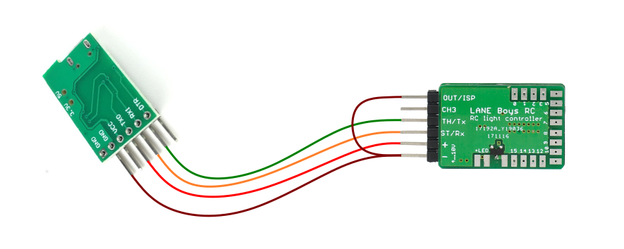

# Light controller MK4 TLC5940 LPC812 / LPC832

Usually light controller users can use the on-line Configurator at https://laneboysrc.github.io/rc-light-controller/ to adjust all settings to their need and use the WebUSB programmer to flash the resulting firmware.

---

For configuring the light controller offline, please download **[mk4-download-me.zip](mk4-download-me.zip)**.

This archive contains the configuration tool *configurator.html*. Open this file in your Web browser.
**configurator.html has the firmware already embedded**, just set the options you want and click on the *Save firmware image...* button.

The configured firmware image *light_controller.hex* will be stored in the *Download* folder of your web browser.

If you don't have the WebUSB programmer, you can use the LPC81x-ISP tool included in the archive to flash the firmware. You need a USB-to-serial adapter to connect your PC to the light controller.

Wire-up the USB-to-serial adapter as follows:

---

In the rare event you want to modify the firmware, please consult [README.md](firmware/README.md) for build instructions.
